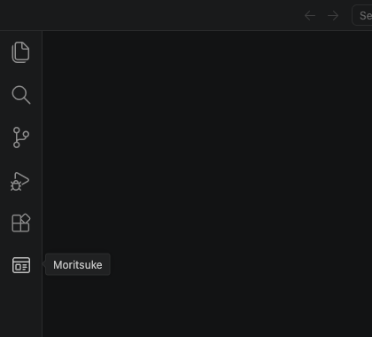
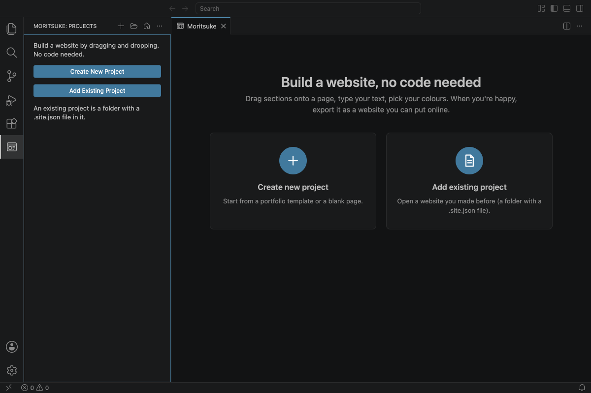
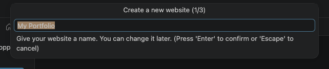
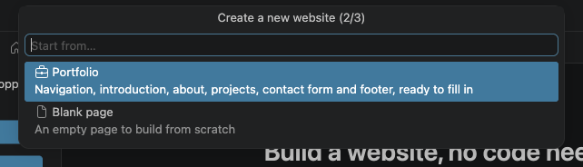
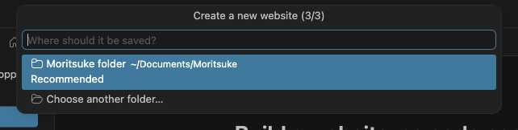
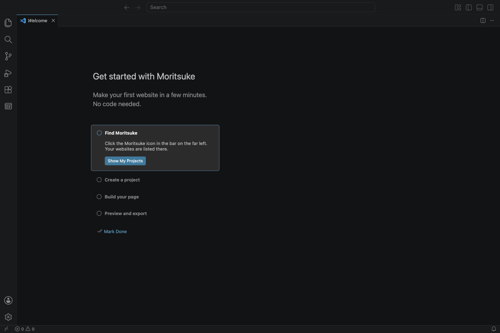

# 1. Getting started

This chapter takes you from installing Moritsuke to having your first website open in the editor. It takes about five minutes.

## Install Moritsuke

Moritsuke is an extension for [Visual Studio Code](https://code.visualstudio.com) (VS Code), a free program for Mac, Windows and Linux. Install VS Code first if you don't have it.

**From a `.vsix` file** (for example, downloaded from a website):

1. Open VS Code.
2. Open the **Extensions** view: click the icon with four squares in the bar on the far left (or press Cmd+Shift+X on a Mac, Ctrl+Shift+X on Windows).
3. Click the **⋯** menu at the top of the Extensions view and choose **Install from VSIX…**
4. Pick the `moritsuke-….vsix` file.

You can also drag the `.vsix` file onto the Extensions view.

## Find Moritsuke

After installing, a new icon appears in the bar on the far left of VS Code, below the Extensions icon. It looks like a small browser window. Point at it to see its name.

Click it. Two things open:

- On the left, the **Projects** list. It's empty for now, so it shows two buttons.
- In the middle, the **Moritsuke** tab, with the same two choices in bigger boxes.

- **Create new project** starts a brand new website.
- **Add existing project** opens a website you made before (see [Managing your projects](10-projects.md)).

## Create your first website

Click **Create new project**. VS Code asks three quick questions at the top of the window.

**1. A name.** Type the name of your website, for example *My Portfolio*, and press Enter. You can change it later.

**2. A starting point.** Choose one with the arrow keys or the mouse, then press Enter:

- **Portfolio**: a ready-made dark page with a menu, an introduction, an About section, a project grid, a contact form and a footer. You replace the example text and pictures with your own.
- **Minimal portfolio**: a light, quiet page with a large introduction, your selected work in big cards, an About section with your experience, and an email link. The grey pictures show the size that fits (1200 × 750); replace them with your own.
- **Blank page**: an empty page to build from scratch.

**3. Where to save it.** The suggested **Moritsuke folder** (in your Documents folder) is a good choice. You can also pick another folder.

Your website opens in the editor:

> **Tip:** to give the editor more room, hide the Projects list on the left with **Cmd+B** (Mac) or **Ctrl+B** (Windows). Press it again to bring the list back.

## Save your work

Moritsuke saves like any other file in VS Code:

- A **dot** on the tab (next to the file name) means there are unsaved changes.
- Press **Cmd+S** (Mac) or **Ctrl+S** (Windows) to save.
- **Undo** with Cmd+Z / Ctrl+Z, **redo** with Cmd+Shift+Z / Ctrl+Y.

## The built-in guide

VS Code also has a short **Get started with Moritsuke** guide with the same first steps. To open it: press Cmd+Shift+P / Ctrl+Shift+P, type **Open Walkthrough**, and choose **Get started with Moritsuke**.

---

Next: [The editor](02-the-editor.md)
