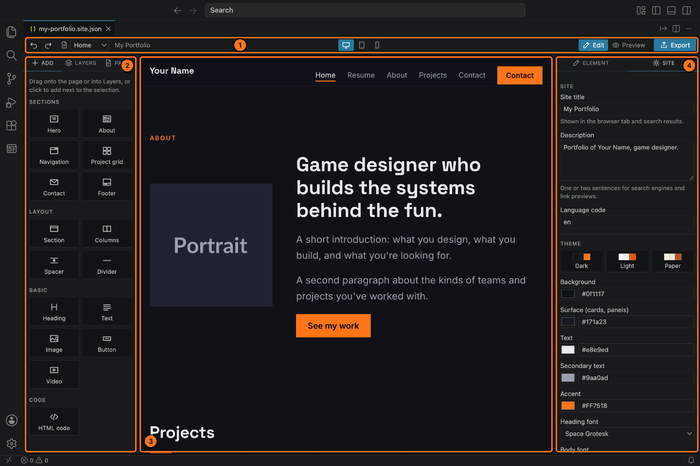
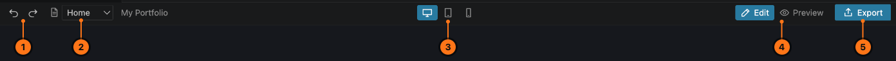

# 2. The editor

The editor has four parts.

1. **Toolbar**: undo, pages, screen sizes, Preview and Export.
2. **Left panel**: three tabs.
   - **Add**: everything you can put on a page.
   - **Layers**: what's on the current page, as a list.
   - **Pages**: the pages of your website.
3. **Page**: your website, as visitors will see it. Click things to select them, drag them to move them.
4. **Right panel**: two tabs.
   - **Element**: the settings of whatever you selected on the page.
   - **Site**: settings for the whole website (title, colours, fonts, export).

When the editor is narrow, the left panel tabs show only their icons. Point at an icon to see its name.

**More room for the page.** Drag the edge of either side panel to make it wider or narrower, and double-click the edge to put it back. The two buttons at the far ends of the toolbar hide a panel completely, which gives the page the full window. Press them again to bring it back. The editor remembers your choice.

## The toolbar

1. **Undo** and **redo**.
2. **Page menu**: switch to another page of your website. The site title is shown next to it.
3. **Screen size**: see the page as it looks on a **desktop** computer, a **tablet** or a **phone**. See [Screen sizes and Preview](08-preview-and-screen-sizes.md).
4. **Edit / Preview**: *Edit* is where you build. *Preview* lets you use the page like a visitor would: open menus, filter projects, follow links.
5. **Export**: saves your website as real web pages you can put online. See [Exporting](09-export.md).

---

Next: [Adding and arranging](03-adding-and-arranging.md)
