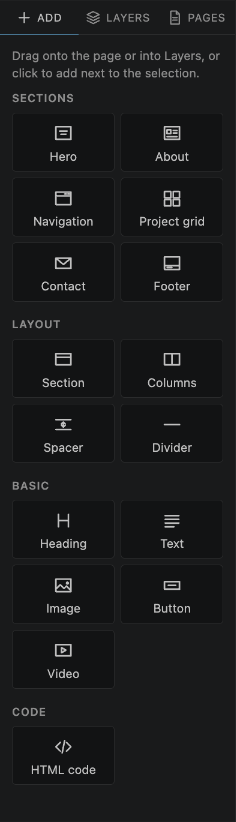
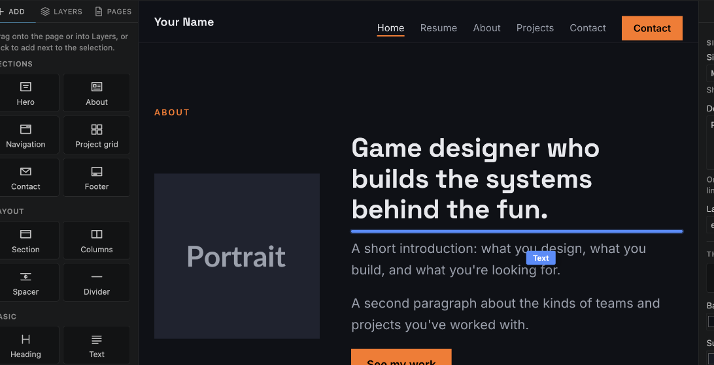
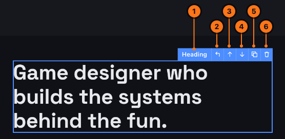
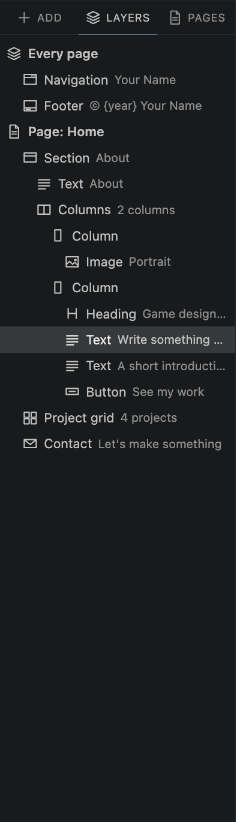
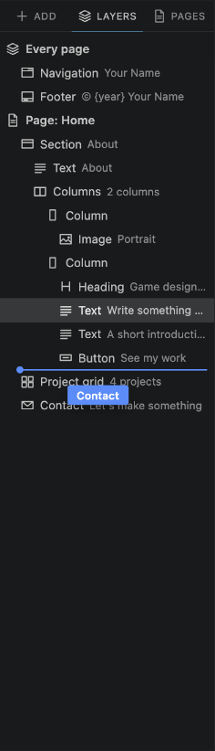

# 3. Adding and arranging

## The Add panel

The **Add** tab on the left has everything you can put on a page, in four groups:

- **Sections**: big building blocks that fill the width of the page (Hero, About, Navigation, Project grid, Contact, Footer).
- **Layout**: things that organise the page (Section, Columns, Spacer, Divider).
- **Basic**: the content itself (Heading, Text, Image, Button, Video).
- **Code**: HTML code, for people who write code.

[Everything you can add](05-elements.md) shows each one.

## Two ways to add something

**Drag it onto the page.** While you drag, a **blue line** shows exactly where it will land. When you drag into an empty area, the area is highlighted instead. Let go to drop it there.

**Or click it.** It's added right after the element you have selected (or at the end of the page if nothing is selected), and the page scrolls to it.

### Where things can go

You don't need to think about this much: the blue line only appears where the element fits.

- **Sections** go on the page, between other sections.
- **Basic** elements (Heading, Text, Image, Button, Video) and Columns, Spacer and Divider go **inside a section**. If you drop one between two sections, a new section is created around it automatically.
- Inside **Columns**, each column is its own area you can drop elements into.

## Select, move, copy and delete

**Click** anything on the page to select it. It gets a blue outline and a small bar with buttons:

1. The **type** of element you selected.
2. **Select the parent**: select what this element sits in (for example the section around a heading). On a section, it opens the page's settings.
3. **Move up** (or left, for a column).
4. **Move down** (or right, for a column).
5. **Duplicate**: make a copy right below it.
6. **Delete**.

**Select several at once.** Hold **Shift** (or **Cmd** / **Ctrl**) and click more elements, on the page or in Layers. They all get an outline, and the right panel says how many you picked. Change a setting once and it applies to every one of them: five buttons all centred in a single go. Pick different kinds of element and you get the settings they have in common. Shift-click a selected element again to drop it from the selection, or click anywhere without holding Shift to start over.

**Delete**, **Cmd+D** and the panel's duplicate button work on the whole selection too.

You can also:

- **Drag** a selected element to move it to another place, even into another section. Near the top or bottom edge of the page area, the page scrolls by itself. Press **Esc** while dragging to cancel.
- Use the keyboard: **Delete** or **Backspace** deletes, **Cmd+D** / **Ctrl+D** duplicates, **Alt+↑** / **Alt+↓** moves up or down, **Esc** selects the parent.

The navigation bar and footer are special when they're **shown on every page** (see [Pages](06-pages.md)): they stay at the top and bottom, so they can't be dragged on the page.

## The Layers panel

The **Layers** tab shows everything on the current page as a list, with things inside other things indented below them.

- **Every page** holds the navigation bar and footer that appear on all pages.
- **Page: Home** (or the name of the page you're on) holds this page's sections.
- **Click** a row to select that element. The page scrolls to it.
- **Drag** rows to reorder them or move them into another section or column. A **line** means "put it here", a **highlighted row** means "put it inside this one".

Layers is handy for small or hidden things, like a spacer, or an element deep inside columns.

> **Tip:** you can also drag something from **Add** into **Layers**: while dragging, rest the pointer on the **Layers** tab for a moment and it opens.

---

Next: [Changing text, images and settings](04-editing-content.md)
