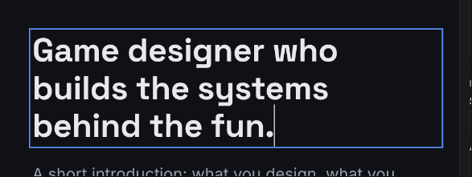
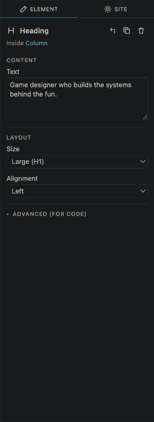
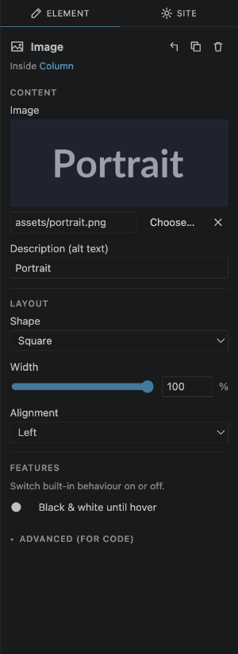
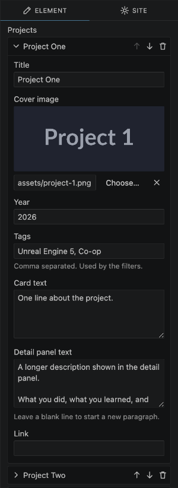
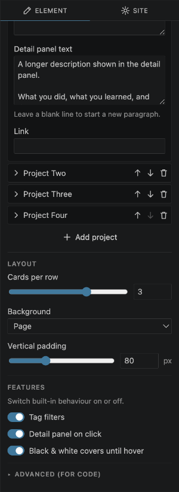

# 4. Changing text, images and settings

## Type directly on the page

**Double-click** any text on the page to change it right there: headings, paragraphs, button labels, the name in the navigation bar, and the titles of sections.

- **Headings, buttons and titles:** press **Enter** when you're done. **Shift+Enter** starts a new line in a heading.
- **Paragraphs:** **Enter** starts a new line (press it twice for a new paragraph). Press **Esc** or **Cmd+Enter** / **Ctrl+Enter** when you're done.
- **Clicking somewhere else** also finishes and keeps what you typed.
- Pasted text arrives as plain text, without formatting.

## The Element settings

Select something on the page and the **Element** tab on the right shows its settings, in groups:

- **Content**: the text, pictures and links.
- **Layout**: size, shape, alignment, spacing and background.
- **Features**: switches for built-in behaviour (see below).
- **Advanced (for code)**: closed by default; see [For people who write code](11-for-developers.md).

At the top, **Inside …** tells you what the element sits in. Click it to select that. The buttons next to the name select the parent, duplicate and delete.

Changes show on the page immediately.

## Pictures

Select an image (or a project in a project grid) to see its picture settings:

- **Choose…** picks a picture from your computer. If it's outside your project, a copy is put in your project's `assets` folder, so the website keeps working when you move or share the project.
- You can also type a path (like `assets/photo.jpg`) or paste a web address (starting with `https://`).
- **×** removes the picture.
- **Description (alt text)** describes the picture for people using screen readers, and for search engines.
- **Shape** crops the picture: original, square, 4:3, 16:9 or portrait.
- **Width** and **Alignment** set its size and position.

If you replace a picture file on your computer with a new version, the page updates by itself.

## Lists: projects and links

Some elements hold a list, like the projects in a **Project grid** or the links in a **Footer**.

- Click a row to **open** it and edit it. Click again to close it.
- **↑** and **↓** reorder, the **bin** removes.
- **Add project** (or **Add link**) adds a new one at the end, already opened.

For projects, **Tags** are separated by commas (for example `Unity, Game Jam`). The tags become the filter buttons above the grid.

## Features: switch behaviour on or off

The **Features** group has switches for things the element can do. For example, a project grid:

- **Tag filters**: buttons above the grid to show only projects with a certain tag.
- **Detail panel on click**: clicking a project opens a large panel with its picture and full description.
- **Black & white covers until hover**: pictures turn to colour when the mouse is over them.

Most features only work when someone uses the page, so try them in **Preview** (see [Screen sizes and Preview](08-preview-and-screen-sizes.md)).

---

Next: [Everything you can add](05-elements.md)
