# 5. Everything you can add

Every section and element, what it looks like, and its settings. Select one on the page to see its settings in the **Element** tab (see [Changing text, images and settings](04-editing-content.md)).

**Contents:** [Sections](#sections) · [Layout](#layout) · [Basic](#basic) · [Code](#code)

## Sections

### Hero

A big welcome at the top of a page: a small label, your name, one line about you, and a button.

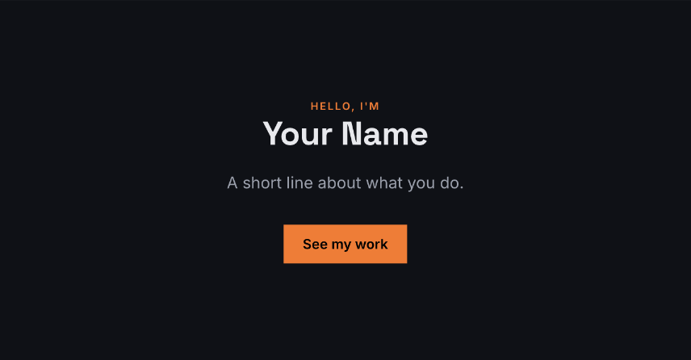

The Hero is made of ordinary elements (a section with a text label, a heading, a text, a spacer and a button), so you can change, move or delete each part.

### About

A label, a picture on one side, and a heading, text and button on the other.

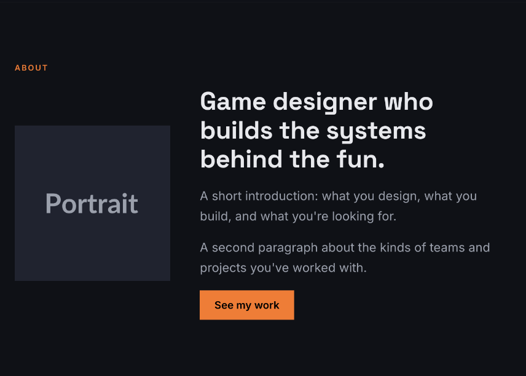

Like the Hero, it's made of ordinary elements: a section containing **Columns**.

### Navigation

The bar at the top of the page, with your name and links.

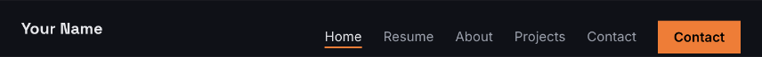

**Content:** the name or logo text, and an optional **button** (label and link).

**Features:**

- **Show on every page**: one navigation bar for all pages (see [Pages](06-pages.md)).
- **Links to pages**: a link to each page, when your website has more than one. The page you're on is underlined.
- **Links to this page's sections**: a link to each section that has a **Menu label** (see [Section](#section)).
- **Stays at the top while scrolling**.
- **Collapsible menu on phones**: on small screens the links fold into a ☰ button.

### Project grid

Cards for your projects, with optional filters and a detail panel.

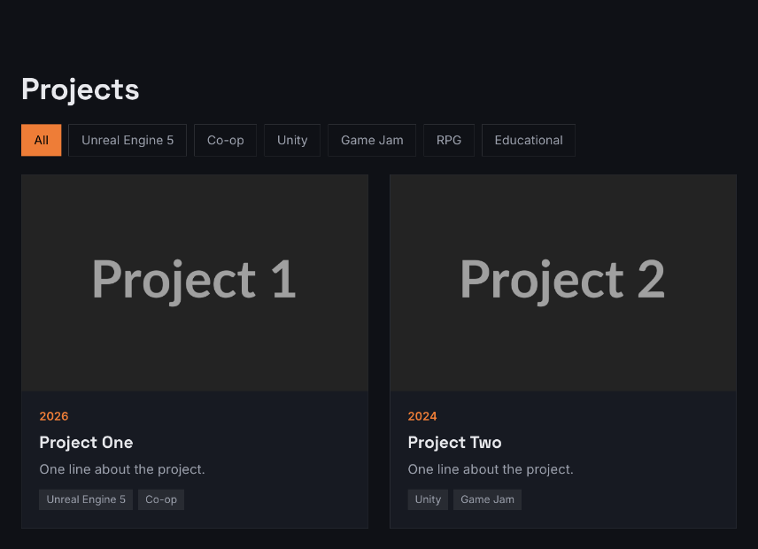

**Content:** a **menu label**, a **heading**, and the list of **projects**. Each project has a title, cover picture, year, tags, card text, detail panel text and an optional link.

**Layout:** cards per row (1 to 4), background and spacing. On tablets the grid shows up to 2 cards per row, on phones 1.

**Features:** tag filters, detail panel on click, black-and-white covers until hover. Without the detail panel, a project with a link shows a **View project** link on its card instead.

### Contact

A heading, a short intro, your email address and an optional contact form.

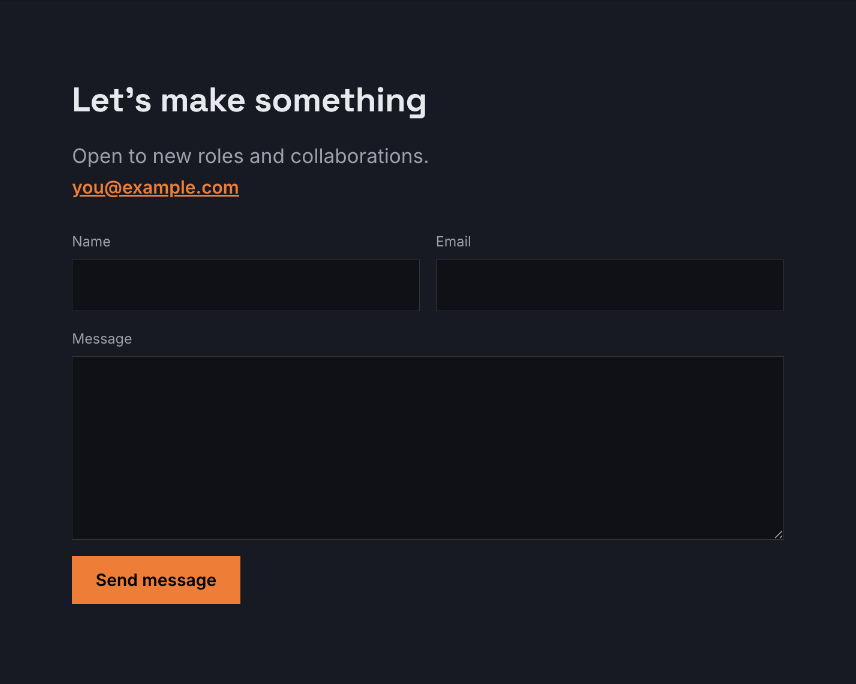

**Content:** menu label, heading, intro, email address, and for the form:

- **Form sends with**
  - *Visitor's email app*: the form opens the visitor's own email program with the message filled in. Works anywhere, nothing to set up.
  - *POST to a URL*: the form sends the message to your own server. Only for people who have one.
- **Button label**, and the **message after sending** (for the server option).

**Features:** **Contact form** (turn it off to show only your email address) and **Subject field**.

### Footer

The bar at the bottom of the page.

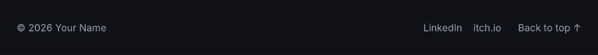

**Content:** the text (`{year}` becomes the current year automatically) and a list of **links**.

**Features:** **Show on every page** and a **Back to top** link.

## Layout

### Section

A band across the page that holds other elements. Most pages are a stack of sections.

**Content:** **Menu label**. When it's filled in, the navigation bar gets a link that scrolls to this section.

**Layout:**

- **Content width**: the theme width, narrow (good for text), or full width.
- **Alignment**: left, center or right.
- **Background**: the page colour, the surface colour or the accent colour.
- **Vertical padding**: space above and below.

### Columns

Puts elements side by side. Each column is its own area to drop elements into.

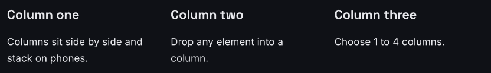

**Layout:** number of columns (1 to 4), gap between them, and vertical alignment (top, middle, bottom). Select a single **column** to set its **relative width** (a column with 2 is twice as wide as one with 1).

**Features:** **Stack on phones** puts the columns under each other on small screens.

If you reduce the number of columns, the content of the removed columns moves into the last remaining column, so nothing is lost.

### Spacer

Empty space. Set its **height**.

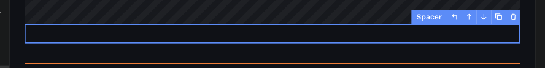

### Divider

A thin horizontal line. Turn on **Accent colour** for a coloured line.

## Basic

### Heading

A title. **Size**: large (H1), medium (H2) or small (H3). **Alignment**: left, center or right.

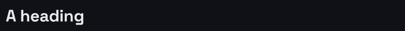

Use one large heading per page, for its main title.

### Text

Paragraphs of text. Leave a blank line between paragraphs.

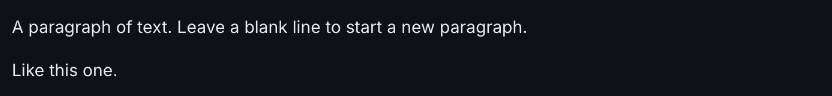

**Style:**

- **Body**: normal text.
- **Lead**: larger text for introductions.
- **Small**: smaller, softer text.
- **Label**: small capital letters in the accent colour, like *ABOUT*.

### Image

A picture. See [Pictures](04-editing-content.md#pictures) for all its settings.

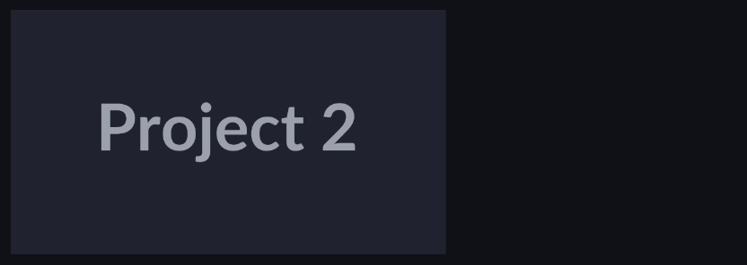

**Features:** **Black & white until hover**.

### Button

A link that looks like a button.

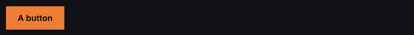

- **Label** and **Link**. The link can be:
  - a web address (`https://…`)
  - a section on the same page (`#contact`)
  - another page of your website (`resume.html`)
  - an email address (`mailto:you@example.com`)
- **Style**: filled, outline, or a plain text link.
- **Features:** **Open in a new tab**.

### Video

A **YouTube link** (paste the address of the video), or a **video file** in your project (like `assets/clip.mp4`).

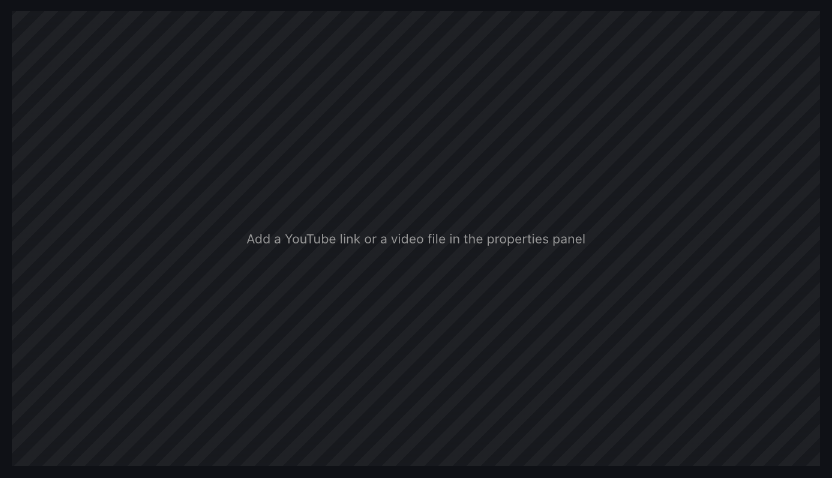

**Features:** **Play muted in a loop** for video files, for short background clips.

YouTube videos show their preview picture in the editor and play on your exported website once it's online.

## Code

### HTML code

For people who write code: paste an embed code (a map, a music player, a form service…) or write your own HTML.

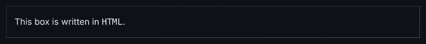

See [For people who write code](11-for-developers.md#the-html-code-element).

---

Next: [Pages](06-pages.md)
