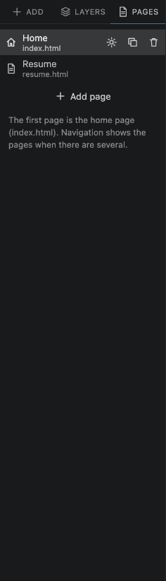
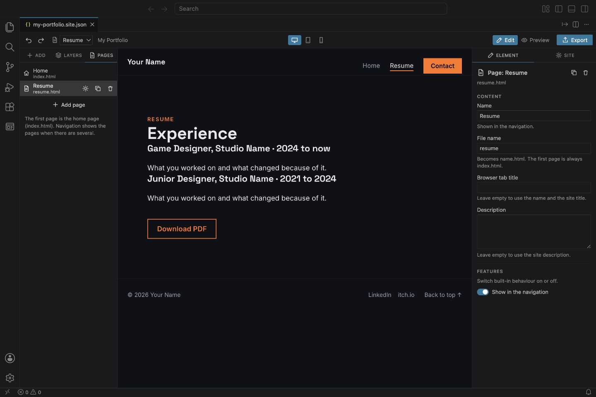
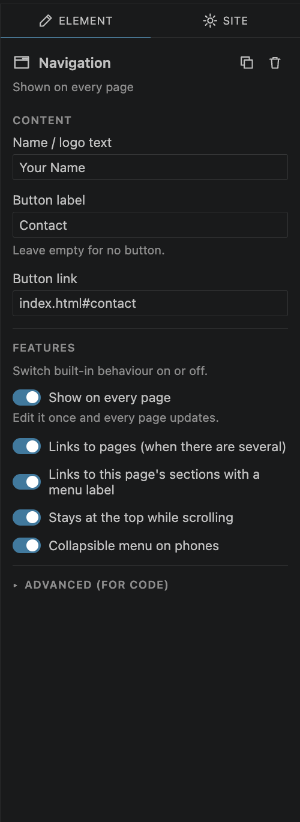

# 6. Pages

A website can have several pages, like **Home**, **Resume** and **Blog**.

## The Pages panel

Open the **Pages** tab on the left.

- **Click** a page to show it on the canvas.
- **Drag** a page up or down to change the order. The order is also the order of the links in the navigation bar.
- **Add page** creates a new empty page and opens its settings.
- The buttons on a page (shown when you point at it) open its **settings**, **duplicate** it, or **delete** it. You can't delete the last page, and the Delete key never deletes a page, so you can't remove one by accident. Deleted a page by mistake? Press **Undo**.

The **first page is your home page**: the page visitors see first (`index.html`).

You can also switch pages with the **page menu** in the toolbar.

## Page settings

Click the settings button on a page (or select it in Layers) to see its settings:

- **Name**: shown in the navigation bar.
- **File name**: the page's address, for example `resume` becomes `resume.html`. The first page is always `index.html`.
- **Browser tab title**: the text in the browser tab. Leave it empty to use the page name and the site title.
- **Description**: shown by search engines. Leave it empty to use the site description.
- **Show in the navigation**: turn off for pages that shouldn't be in the menu (for example a thank-you page).

## A menu and footer on every page

Usually every page should have the same navigation bar and footer. Select the navigation bar (or footer) and turn on **Show on every page** in its **Features**:

Now it appears on all pages, and changing it once changes it everywhere. In **Layers** it moves to the **Every page** group. You can also drag a navigation bar or footer into **Every page** in Layers.

Turning **Show on every page** off keeps it only on the page you're looking at.

## Links between pages

- With more than one page, the navigation bar links to every page (unless you turn **Links to pages** off, or turn off **Show in the navigation** for a page). The current page is underlined.
- Links to the **sections** of a page (from their **Menu label**) only appear on that page.
- To link to a page from a **Button**, use its file name, like `resume.html`. To link to a section on another page, add the section after a `#`, like `index.html#contact`.

Try links in **Preview**: clicking a link to another page switches to it.

---

Next: [Colours, fonts and site details](07-site-and-theme.md)
