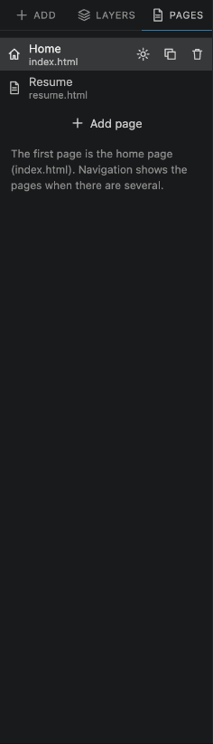
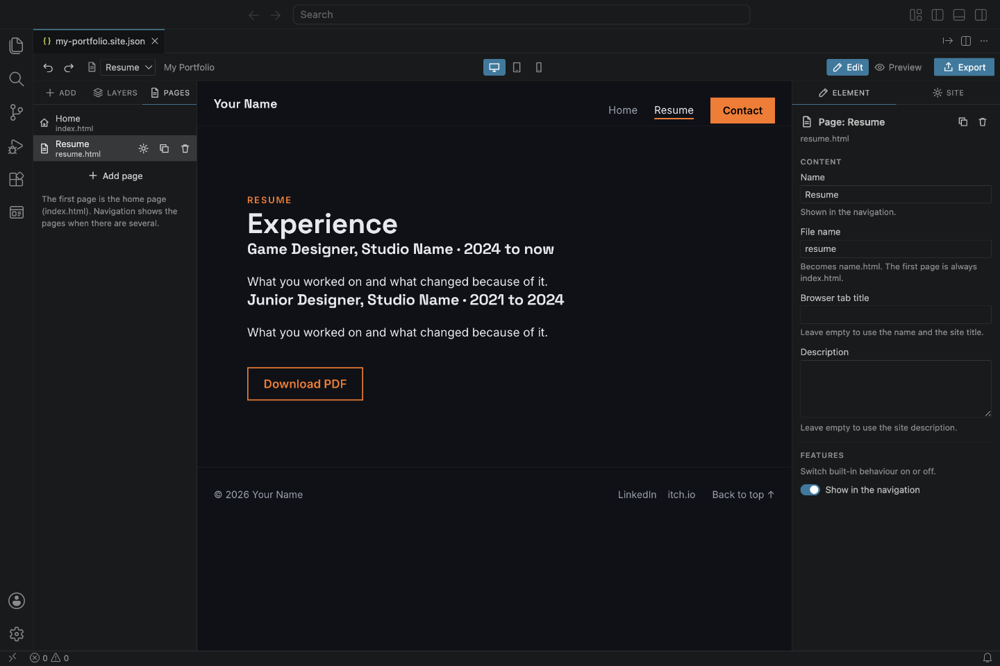
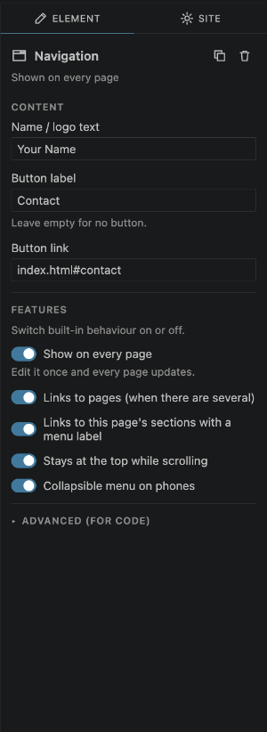

# 6. Pages

A website can have several pages, like **Home**, **Resume** and **Blog**.

## The Pages panel

Open the **Pages** tab on the left.

- **Click** a page to show it on the canvas.
- **Drag** a page up or down to change the order. The order is also the order of the links in the navigation bar.
- **Add page** creates a new empty page and opens its settings.
- The buttons on a page (shown when you point at it) open its **settings**, **duplicate** it, or **delete** it. You can't delete the last page, and the Delete key never deletes a page, so you can't remove one by accident. Deleted a page by mistake? Press **Undo**.

The **first page is your home page**: the page visitors see first (`index.html`).

You can also switch pages with the **page menu** in the toolbar.

## Page settings

Click the settings button on a page (or select it in Layers) to see its settings:

- **Name**: shown in the navigation bar.
- **File name**: the page's address, for example `resume` becomes `resume.html`. The first page is always `index.html`.
- **Browser tab title**: the text in the browser tab. Leave it empty to use the page name and the site title.
- **Description**: shown by search engines. Leave it empty to use the site description.
- **Show in the navigation**: turn off for pages that shouldn't be in the menu (for example a thank-you page).
- **Page layout**: *Flowing* (the usual way: sections under each other) or *Fixed size*, described next.

## One screen, fixed size

Set **Page layout** to **Fixed size** and the page becomes a single screen of the width and height you choose, like a frame in a design tool. Instead of stacking, you put each element exactly where you want it.

Good for a dashboard, a control panel, a menu screen, or anything that behaves more like an app than a page to read.

How it works:

- The screen's edge is drawn with a dashed line, and its size is written above it, so you can see where the page ends. When the screen is wider than the editor, it's shown smaller so all of it fits ("shown at 68%"); everything you place still lands at its real size.
- Drag anything from the **Add** panel onto the screen and it stays where you drop it.
- Drag an element to move it. Pink lines appear when it lines up with another element or with the middle or edges of the screen, and it snaps into place: edges line up with edges (or sit right against them), and middles with middles. Hold **Alt** while dragging to ignore the snapping.
- The first click on a card (or anything with elements inside) picks the whole card. Click again to reach what's inside it.
- **Resize** by dragging the small white squares around the selected element. Each element fills its box, so a picture, button or card takes exactly the size you drag it to. The sides change one direction at a time; the corners change both. Hold **Shift** on a corner to keep the proportions. The edge you drag snaps to other elements' edges and the screen's edges, while the opposite edge stays put. Headings and text keep growing with their words unless you drag their height yourself.
- **Arrow keys** move the selection one pixel at a time, or ten with **Shift** held.
- Select several elements (Shift-click) and drag any of them: they all move together, keeping their arrangement. With several selected, the right panel also has buttons to **line them up** (left, middle, right, top, middle, bottom) or **spread them out evenly**.
- When elements overlap, the arrows in the selection bar **bring one forward** or **send it backward**. In the **Layers** panel, the higher an element is in the list, the more in front it is, the same as in design tools. New elements go in front.
- The right panel shows **From the left**, **From the top**, **Width** and **Height** for exact numbers. A height of 0 means "as tall as the content".
- On a narrow window or a phone, the whole screen shrinks so it still fits, keeping your layout exactly as you designed it.

Other pages of the same website stay flowing, so a site can have ordinary pages and app-like screens side by side.

## A menu and footer on every page

Usually every page should have the same navigation bar and footer. Select the navigation bar (or footer) and turn on **Show on every page** in its **Features**:

Now it appears on all pages, and changing it once changes it everywhere. In **Layers** it moves to the **Every page** group. You can also drag a navigation bar or footer into **Every page** in Layers.

Turning **Show on every page** off keeps it only on the page you're looking at.

## Links between pages

- With more than one page, the navigation bar links to every page (unless you turn **Links to pages** off, or turn off **Show in the navigation** for a page). The current page is underlined.
- Links to the **sections** of a page (from their **Menu label**) only appear on that page.
- To link to a page from a **Button**, use its file name, like `resume.html`. To link to a section on another page, add the section after a `#`, like `index.html#contact`.

Try links in **Preview**: clicking a link to another page switches to it.

---

Next: [Colours, fonts and site details](07-site-and-theme.md)
