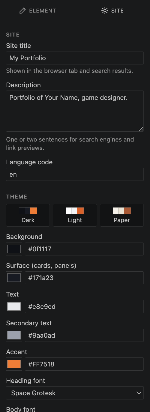
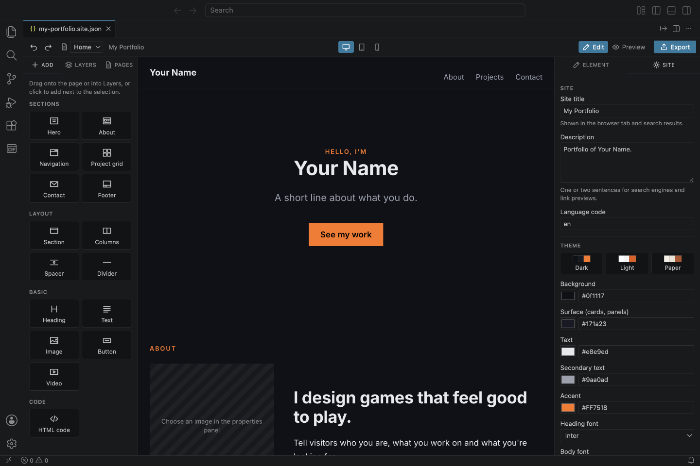
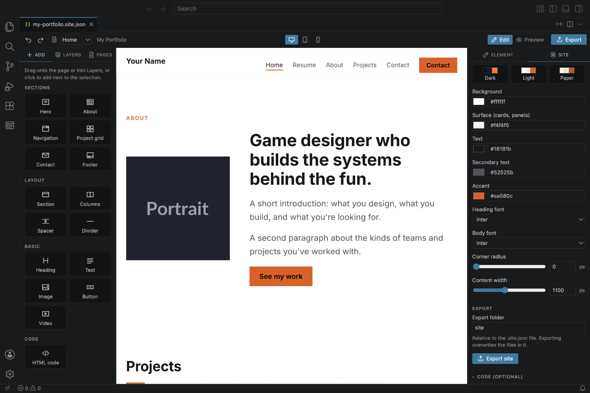
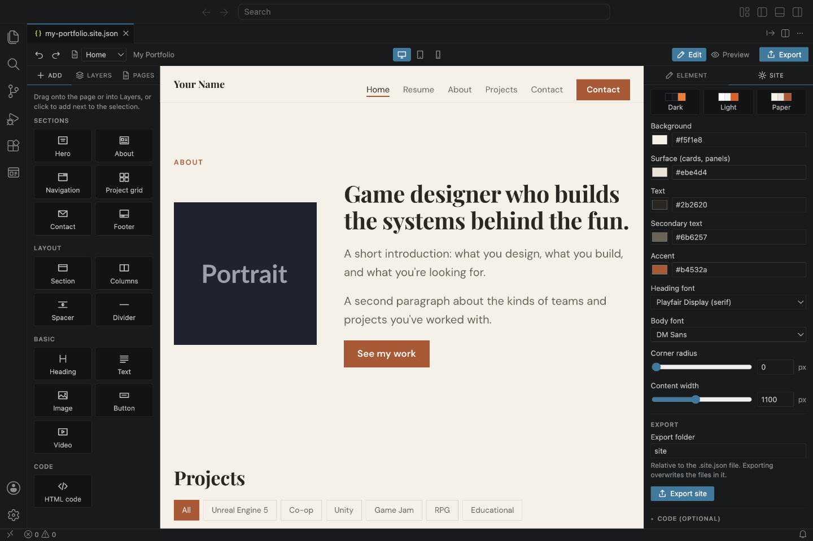

# 7. Colours, fonts and site details

The **Site** tab on the right holds the settings for your whole website.

## Site details

- **Site title**: shown in the browser tab and in search results.
- **Description**: one or two sentences that search engines and link previews show.
- **Language code**: the language of your website, for example `en` for English or `fr` for French.

## Theme

**Presets** change all colours at once (and, for Paper, the fonts too). Start with a preset, then adjust.

| Dark | Light | Paper |
| --- | --- | --- |
|  |  |  |

**Colours:**

- **Background**: the page.
- **Surface**: cards, the contact section and panels.
- **Text** and **Secondary text** (softer text, like descriptions).
- **Accent**: buttons, labels, links and highlights. The text on accent-coloured buttons turns black or white automatically, whichever is easier to read.

Click the coloured square to pick a colour, or type a colour code like `#FF7518`.

**Fonts:** a **Heading font** and a **Body font**. *System font* uses the visitor's own computer font and loads instantly. The others come from Google Fonts.

**Corner radius:** `0` for square corners, higher for rounder buttons, cards and pictures.

**Content width:** how wide the content of sections gets on big screens.

## Export folder

The name of the folder your website is exported to (`site` by default). See [Exporting](09-export.md).

## Code (optional)

At the bottom, for people who write code. See [For people who write code](11-for-developers.md).

---

Next: [Screen sizes and Preview](08-preview-and-screen-sizes.md)
