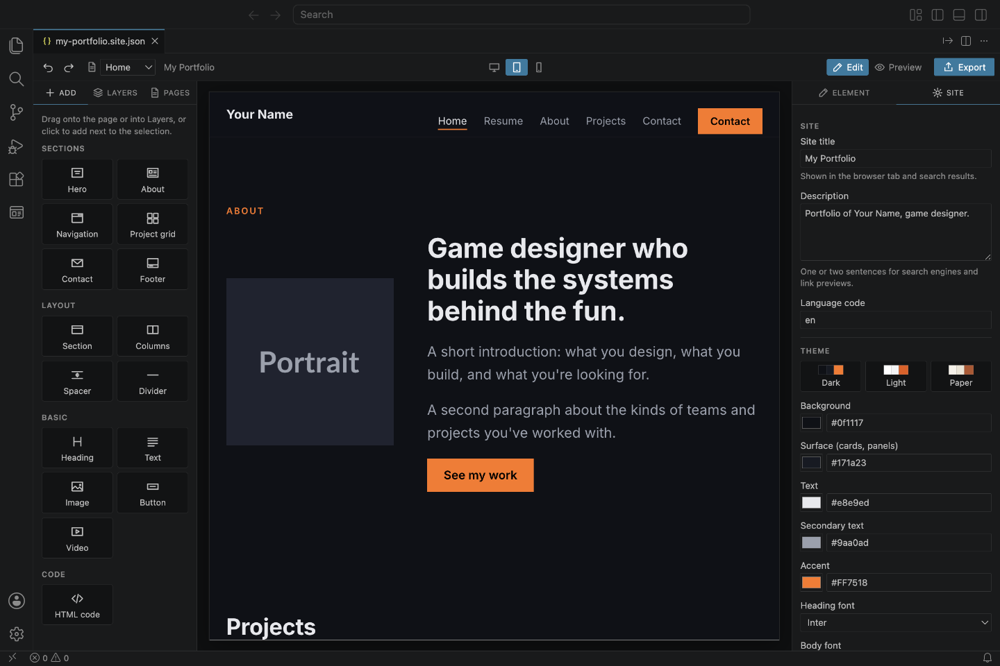
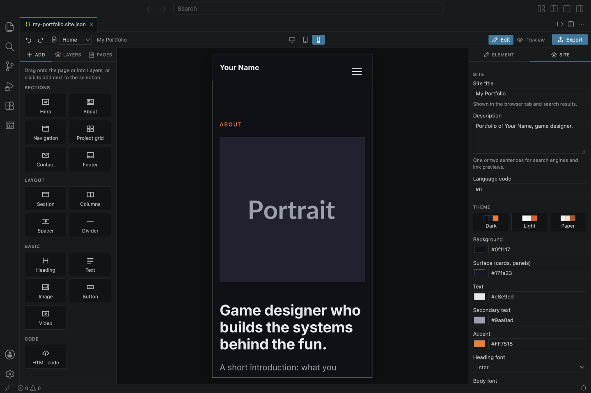
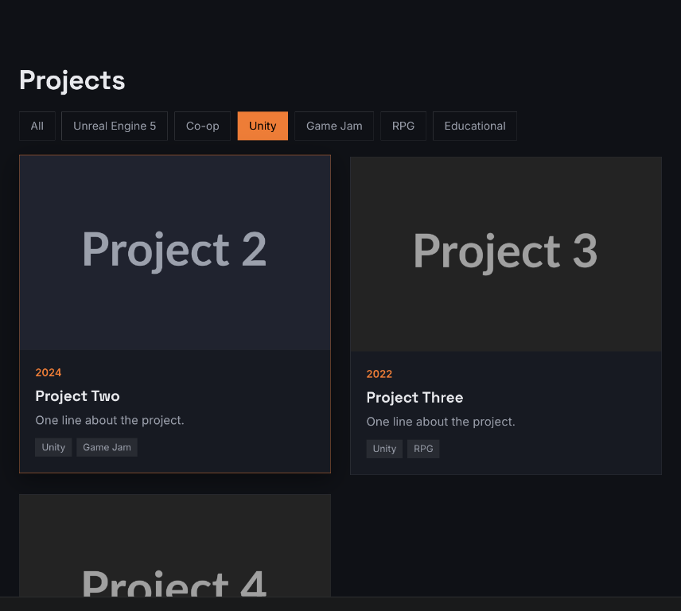
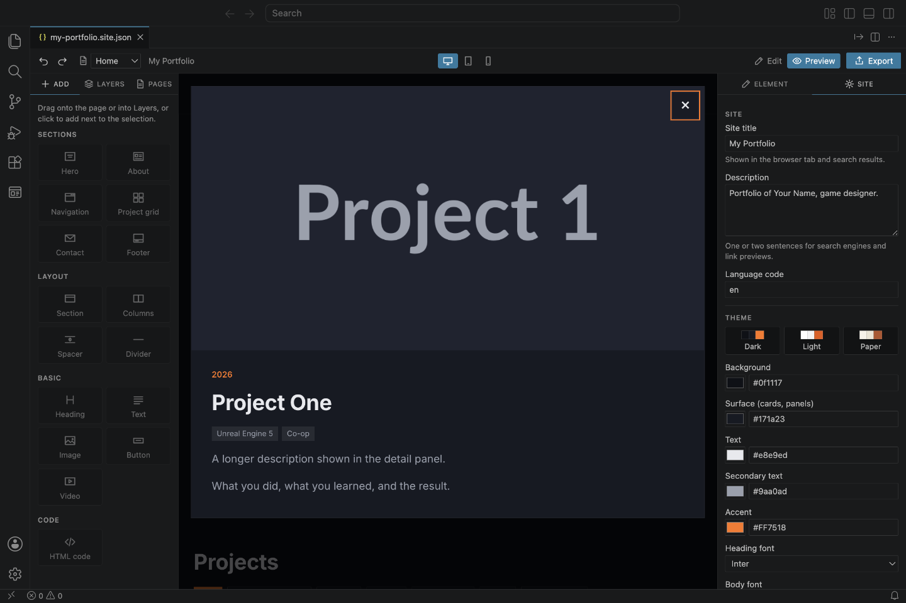

# 8. Screen sizes and Preview

## Desktop, tablet and phone

Most visitors will see your website on a phone. Use the three buttons in the middle of the toolbar to check how it looks on each screen size. You can keep editing in any of them.

| Tablet | Phone |
| --- | --- |
|  |  |

On small screens, Moritsuke adjusts the page automatically:

- **Columns** stack under each other (unless **Stack on phones** is off).
- The **navigation links** fold into a ☰ menu button (unless **Collapsible menu on phones** is off).
- **Project grids** show fewer cards per row.

> **Why does the Desktop view look like a phone?** The page area is simply narrower than a real desktop screen. Make the VS Code window bigger, or hide the side bar with **Cmd+B** / **Ctrl+B**.

## Preview

In **Edit** mode, clicking selects things. Switch to **Preview** (top right) to use the page like a visitor:

- Open the ☰ menu on phones.
- Click the menu links: they scroll to the section, or open the other page.
- Filter projects by tag:

  

- Open a project's detail panel:

  

- Links to other websites open in your normal browser.

Switch back to **Edit** to keep building.

A few things only work on the real, exported website, not in Preview:

- Sending the **contact form**.
- **Scripts** inside an HTML code element.
- **YouTube videos** may not play inside VS Code; they play on your website once it's online.

---

Next: [Exporting and putting it online](09-export.md)
