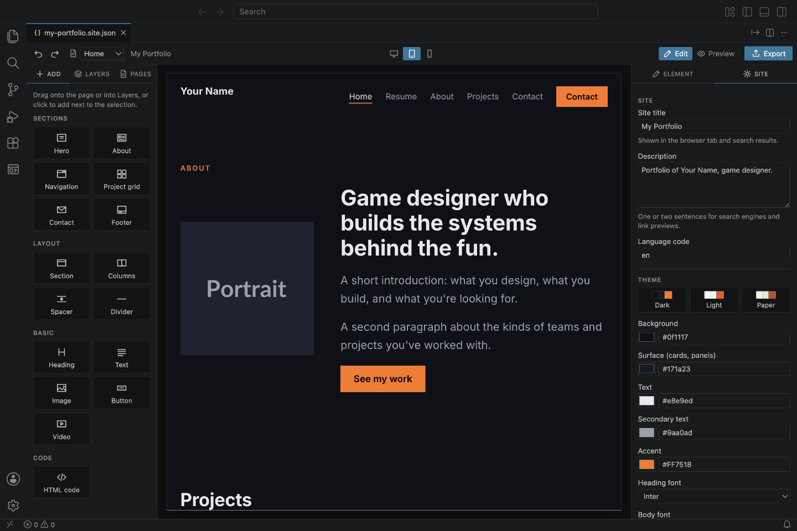
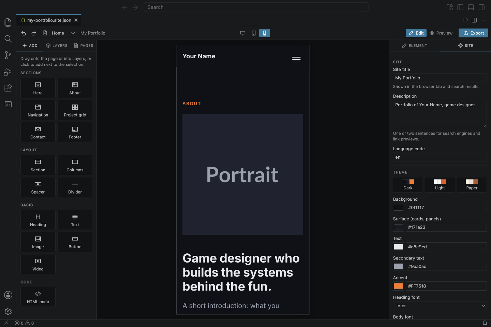
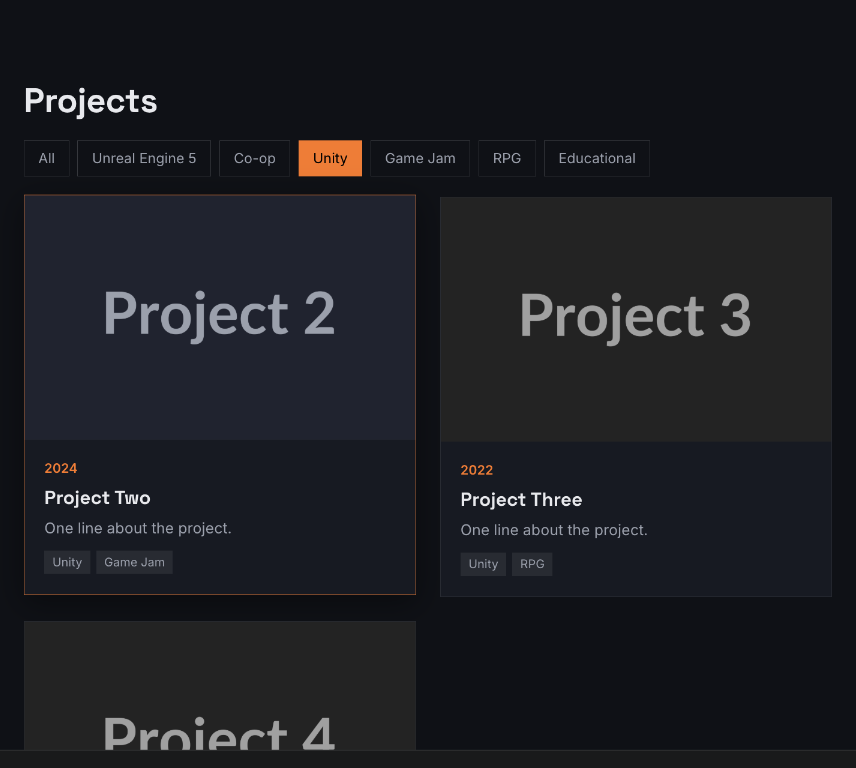
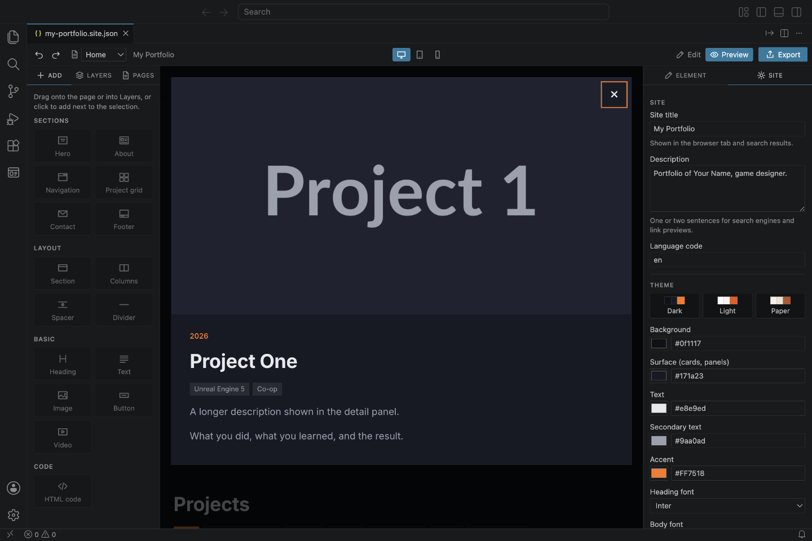

# 8. Screen sizes and Preview

## Desktop, tablet and phone

Most visitors will see your website on a phone. Use the three buttons in the middle of the toolbar to check how it looks on each screen size. You can keep editing in any of them.

| Tablet | Phone |
| --- | --- |
|  |  |

On small screens, Moritsuke adjusts the page automatically:

- **Columns** stack under each other (unless **Stack on phones** is off).
- The **navigation links** fold into a ☰ menu button (unless **Collapsible menu on phones** is off).
- **Project grids** show fewer cards per row.

> **Why does the Desktop view look like a phone?** The page area is simply narrower than a real desktop screen. Make the VS Code window bigger, or hide the side bar with **Cmd+B** / **Ctrl+B**.

## Preview

In **Edit** mode, clicking selects things. Switch to **Preview** (top right) to use the page like a visitor:

- Open the ☰ menu on phones.
- Click the menu links: they scroll to the section, or open the other page.
- Filter projects by tag:

  

- Open a project's detail panel:

  

- Links to other websites open in your normal browser.

Switch back to **Edit** to keep building.

A few things only work on a real website, not in Preview:

- Sending the **contact form**.
- **Scripts** inside an HTML code element.
- **YouTube videos**, which need a real web address.

## Try it in your browser

The browser button in the toolbar (next to **Export**) covers all of those. It exports your website, serves it at an address like `http://localhost:5500`, and opens it in your normal browser. Videos play, forms send, and your own scripts run, exactly as visitors will see it.

The address stays in the status bar at the bottom of VS Code while it's running. Every time you save the project, `custom.css` or `custom.js`, the website is exported again and the browser page reloads by itself. Click the address in the status bar to stop it, or leave it: it stops when you close VS Code.

Only your own computer can reach that address; nothing is put online. Putting it online is the [next chapter](09-export.md).

---

Next: [Exporting and putting it online](09-export.md)
