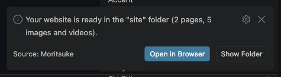

# 9. Exporting and putting it online

## Export

When you're happy with your website, click **Export** in the toolbar (you can also use **Export site** at the bottom of the Site tab).

When it's done, a message appears in the corner of VS Code:



- **Open in Browser** shows your website in your web browser.
- **Show Folder** opens the folder on your computer.

## What you get

Export creates a folder called `site` inside your project folder (you can rename it in the Site tab):

```
My Portfolio/
├── my-portfolio.site.json   ← your project (what the editor opens)
├── assets/                  ← your pictures and videos
└── site/                    ← your exported website
    ├── index.html           ← the home page
    ├── resume.html          ← one file for each other page
    ├── styles.css           ← the look of your website
    ├── site.js              ← menus, filters and the detail panel (only if needed)
    └── assets/              ← the pictures and videos your pages use
```

These are ordinary web files: plain HTML, CSS and JavaScript. They don't need Moritsuke to work.

Export again after every change. It replaces the files in the `site` folder. Old files you no longer use (like a picture you removed) stay in the folder, so delete them yourself if you want a tidy folder.

## Putting it online

Upload the **contents** of the `site` folder to any website host. A few popular options:

- **Netlify** or **Cloudflare Pages**: drag the `site` folder onto their website.
- **GitHub Pages**: put the files in a GitHub repository and turn on Pages.
- **Your own web hosting**: upload the files with the host's file manager or an FTP program.

Things to know:

- **Fonts** from Google Fonts load when the website is online. Choose *System font* if you'd rather not use them.
- The **contact form** set to *Visitor's email app* works everywhere. *POST to a URL* needs your own server.

---

Next: [Managing your projects](10-projects.md)
