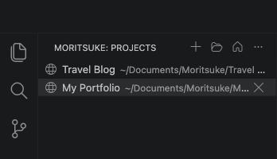
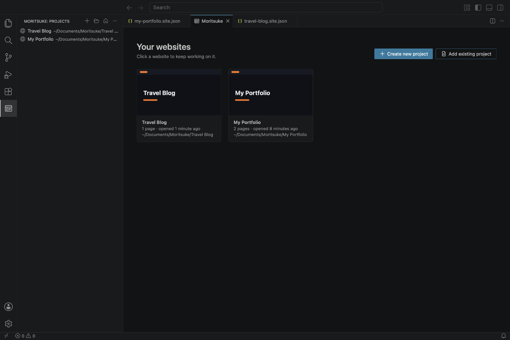
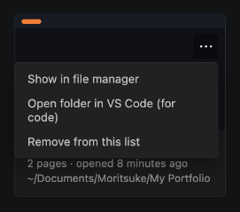

# 10. Managing your projects

A **project** is one website: a folder with a `.site.json` file (the project), an `assets` folder for pictures, and, after exporting, a `site` folder.

## The Projects list

Click the **Moritsuke** icon on the far left to see your projects, most recently opened first.

- **Click** a project to open it.
- The buttons at the top: **+** create a new project, **folder** add an existing project, **house** open the Moritsuke tab.
- Point at a project and click **×** to remove it from the list.
- **Right-click** a project for more: open it, show it in your file manager, open its folder in VS Code, remove it.

## The Moritsuke tab

The same projects, as cards. Clicking the Moritsuke icon opens this tab (unless you're already editing a website).

Each card shows the website's title in its own colours, the number of pages, when you last opened it, and where it's saved. **Click a card** to open the project.

The **⋯** button on a card (shown when you point at the card) has more options:

- **Show in file manager**: opens the project folder in Finder (Mac) or File Explorer (Windows).
- **Open folder in VS Code (for code)**: opens the project folder as a VS Code workspace, for editing files directly.
- **Remove from this list**: takes the project off the list. **Your files are not deleted**, and you can add the project back any time.

## Add an existing project

To open a website made with Moritsuke that isn't in your list (for example one copied from another computer), click **Add existing project** and pick either the project's folder or its `.site.json` file.

- If the folder has one project, it opens.
- If it has several, you choose which one.
- If it has none, you can create a new website in that folder.

Opening any `.site.json` file in VS Code also adds it to the list.

## Moving, renaming and backing up

- **Move or copy** a project by moving or copying its whole folder. Then use **Add existing project** to find it again. A project that was moved shows as *can't be found* in the list; remove it from the list.
- **Rename** a website by changing its **Site title** in the Site tab. The folder name doesn't matter.
- **Back up** a project by copying its folder somewhere safe.

---

Next: [For people who write code](11-for-developers.md)
