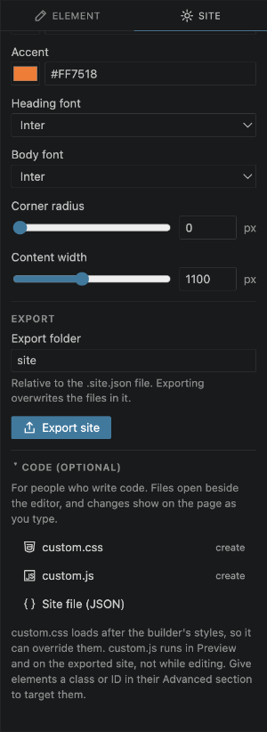
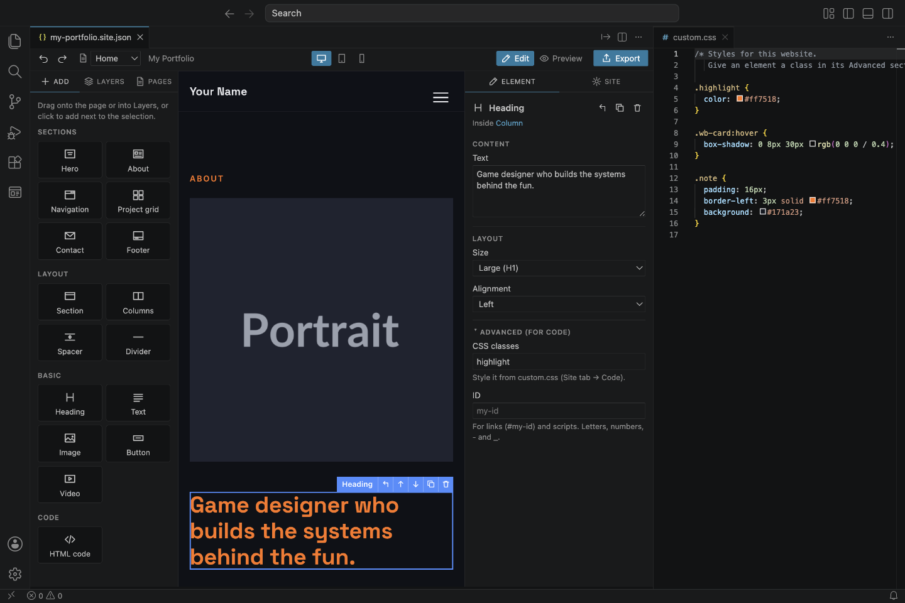
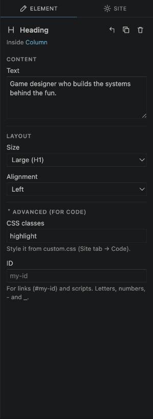
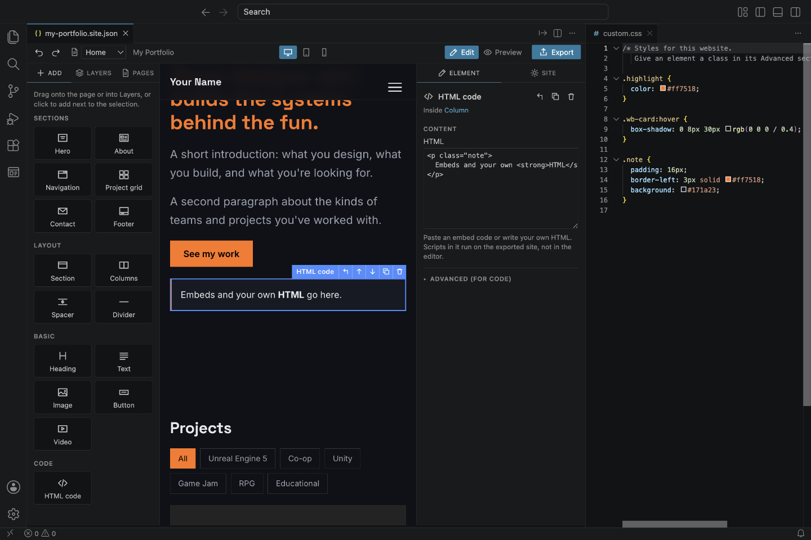
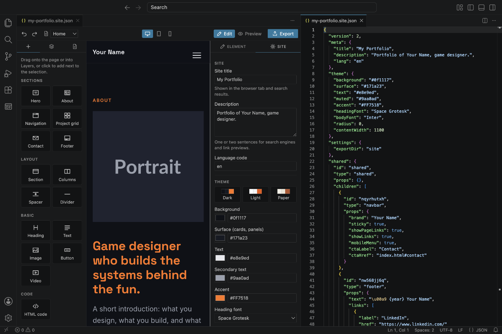

# 11. For people who write code

Everything in the earlier chapters works without code. This chapter is for web developers who want more control. Nothing here gets in the way of beginners: it's all in collapsed sections or at the bottom of panels.

## The Code section

At the bottom of the **Site** tab, open **Code (optional)**:

- **custom.css**: your own stylesheet for this website.
- **custom.js**: your own script.
- **Site file (JSON)**: the project file itself.

Each opens in a normal VS Code editor beside the visual editor, with all of VS Code's code editing features. `custom.css` and `custom.js` are created with a short explanation the first time you open them. The label next to each says **create** or **in use**.

## custom.css: live styling

`custom.css` is loaded **after** Moritsuke's own styles, so it can override anything. Changes show on the page **as you type**, before you even save.

Useful selectors:

- Your own classes and IDs, from the **Advanced** section (below).
- The builder's classes, which all start with `wb-`: `.wb-section`, `.wb-heading`, `.wb-text`, `.wb-button`, `.wb-card`, `.wb-navbar`, `.wb-footer` and so on.
- Theme variables: `var(--wb-accent)`, `var(--wb-bg)`, `var(--wb-surface)`, `var(--wb-text)`, `var(--wb-muted)`, `var(--wb-radius)`, `var(--wb-font-heading)`, `var(--wb-font-body)`.

## custom.js

`custom.js` runs in **Preview** and on the **exported website**, after the page and Moritsuke's own script have loaded. It doesn't run while you edit on the canvas, so it can't interfere with editing.

## Classes and IDs: the Advanced section

Every element has an **Advanced (for code)** section at the bottom of its settings, closed by default.

- **CSS classes**: one or more class names separated by spaces. They're added to the element's outer HTML tag.
- **ID**: a unique name for the element, for `#links` and `document.getElementById`. On a section with a menu label, the ID is also used for the navigation link.

Names that aren't valid in HTML are left out.

## The HTML code element

**Add → Code → HTML code** inserts your own HTML: an embed code (map, music player, form service, social post) or hand-written markup.

- It's shown on the canvas as you type. **Tab** indents in the code box.
- For safety, scripts inside it don't run in the editor or Preview, only on the exported website.
- Style it from `custom.css`.

## The project file (JSON)

**Site file (JSON)** opens the `.site.json` project beside the visual editor. Both show the same file: edit the JSON and the page updates, change the page and the JSON updates. Undo works across both.

The format, briefly:

- `meta`, `theme` and `settings`: the Site tab.
- `shared`: the elements shown on every page.
- `pages`: each page, with its sections in `children`.
- Every element has an `id`, a `type`, its settings in `props`, and `children` if it holds other elements.

If the JSON can't be read (for example a missing comma), the visual editor shows the error and waits until it's fixed.

## Live reload in a browser

To see the real exported website update in your browser while you work:

1. Turn on **Settings → Moritsuke → Export On Save** (see [Settings](12-settings-shortcuts-and-help.md)).
2. Serve the `site` folder with any live-reload server, for example the *Live Server* extension for VS Code.

Now every save of the project, `custom.css` or `custom.js` exports the website, and the browser reloads.

## What the export looks like

The export is plain, readable HTML, CSS and JavaScript, with no framework and no build step:

- One `.html` file per page, with semantic tags (`header`, `section`, `nav`, `footer`, `dialog`).
- `styles.css`: theme variables at the top, then the styles of all elements.
- `site.js`: only the behaviour the page uses (menu, filters, detail panel, form).
- `custom.css` and `custom.js` when they exist, linked after the builder's own files.

---

Next: [Settings, shortcuts and help](12-settings-shortcuts-and-help.md)
