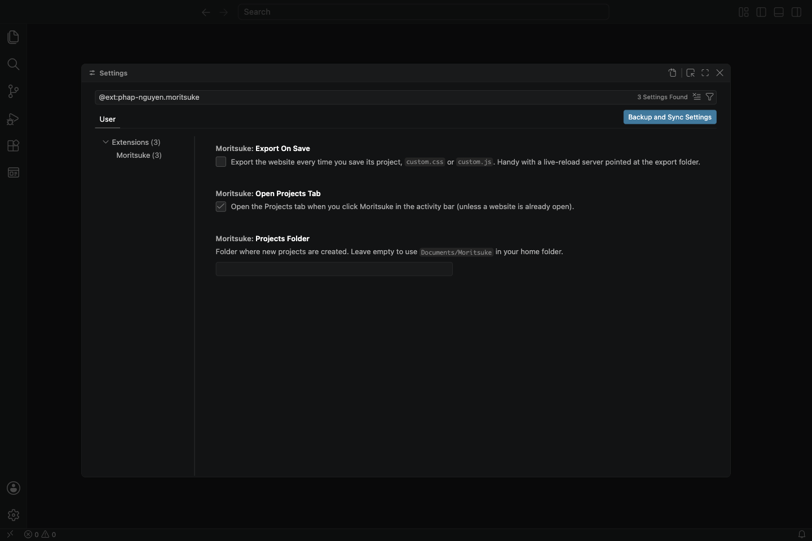

# 12. Settings, shortcuts and help

## Settings

Open VS Code's settings (**Cmd+,** on Mac, **Ctrl+,** on Windows) and search for **Moritsuke**:

| Setting | What it does |
| --- | --- |
| **Export On Save** | Export the website every time you save (for live reload, see [For people who write code](11-for-developers.md#live-reload-in-a-browser)). Off by default. |
| **Open Projects Tab** | Open the Moritsuke tab when you click the Moritsuke icon. On by default. |
| **Projects Folder** | Where new projects are saved. Empty means `Documents/Moritsuke` in your home folder. |

## Keyboard shortcuts

On Windows and Linux, use **Ctrl** where the Mac uses **Cmd**.

| Keys | What it does |
| --- | --- |
| **Cmd+S** | Save |
| **Cmd+Z** | Undo |
| **Cmd+Shift+Z** (Mac), **Ctrl+Y** (Windows) | Redo |
| **Delete** or **Backspace** | Delete the selected element |
| **Cmd+D** | Duplicate the selected element |
| **Alt+↑** / **Alt+↓** | Move the selected element up or down |
| **Esc** | Select the parent element; while dragging, cancel the drag |
| **Double-click** | Type directly on the page |
| **Enter** | Finish typing a heading, button or title |
| **Esc** or **Cmd+Enter** | Finish typing a paragraph |
| **Cmd+B** | Show or hide VS Code's side bar (more room for the editor) |

## Common questions

**The Desktop view looks like a phone.** The page area is narrower than a real desktop screen. Make the VS Code window bigger or hide the side bar (**Cmd+B** / **Ctrl+B**).

**My picture doesn't show.** The picture file was probably moved, renamed or deleted. Select the image and use **Choose…** to pick it again. Pictures chosen with **Choose…** are copied into the project's `assets` folder, so they don't go missing.

**My changes are gone after closing VS Code.** Unsaved changes show as a dot on the tab. Save with **Cmd+S** / **Ctrl+S**. VS Code also keeps unsaved changes when you quit, and brings them back next time.

**The editor says "This site file can't be opened".** The project file has a mistake in it, usually from editing the JSON by hand. Click **Open as text**, fix the mistake (VS Code underlines it), save, and the visual editor comes back.

**Something only works in Preview, or only on the exported website.** See the end of [Screen sizes and Preview](08-preview-and-screen-sizes.md#preview).

**Where are my project files?** In the Moritsuke tab, open a card's **⋯** menu and choose **Show in file manager**.

**I removed a project from the list by mistake.** Removing only takes it off the list. Use **Add existing project** and pick its folder.

**I deleted something by mistake.** Press **Undo** (**Cmd+Z** / **Ctrl+Z**), or use the undo button in the toolbar.

---

Back to the [tutorial overview](README.md)
